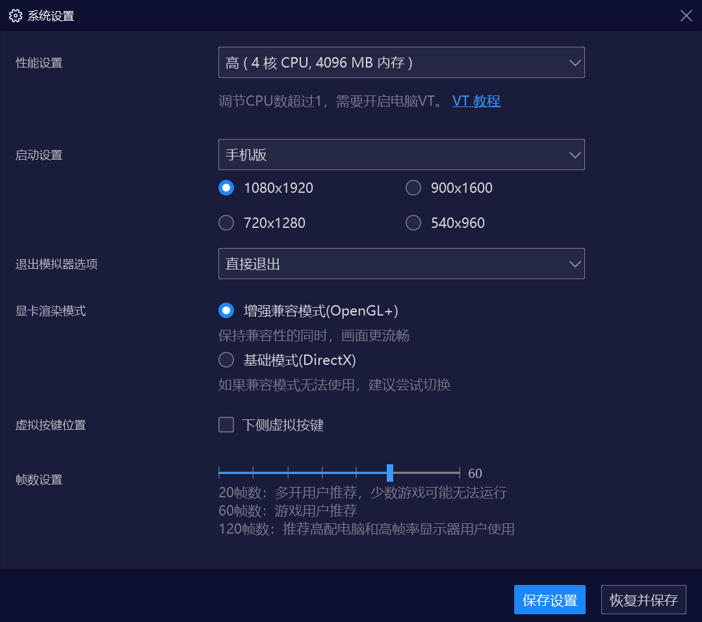
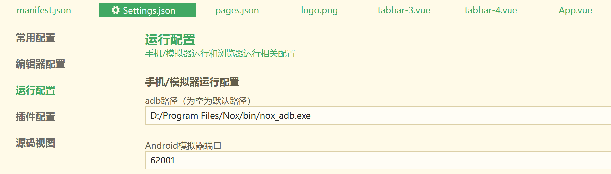
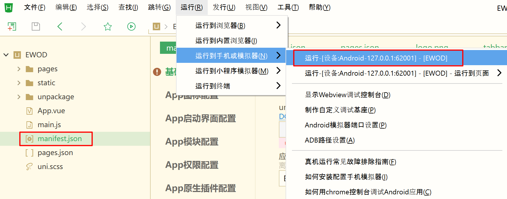

# EWOD-App

## Step 1, 安装HBuilderX
https://dcloud.io/hbuilderx.html, 下载安装HBuilderX
# Step 2, 安装夜神模拟器
去https://www.yeshen.com/ 下载并安装夜神模拟器
# Step 3, 添加模拟器
打开"夜神多开器", 添加模拟器, 设置为手机版
 
# Step 4, 设置"运行设置"
 
# Step 5, 在模拟器中运行app
在夜神多开器中,运行设置好的模拟器.HBuilderX会自动设别该模拟器,点击manifest.json, 然后"运行","运行到手机或模拟器"
 
